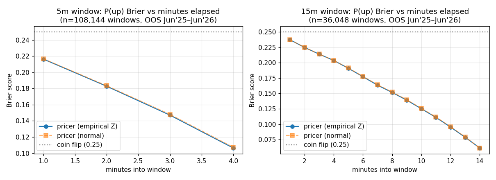

# btc-edge — short-horizon BTC forecasting for prediction markets

Research platform for predicting BTC direction over **5- and 15-minute windows** and
converting those forecasts into **fee- and spread-aware trade signals** for binary
prediction markets (Polymarket "Bitcoin Up or Down", Kalshi BTC strike ladders).

Built and validated on **14 years of real Bitstamp 1-minute data through June 2026**,
with a purged walk-forward harness (54 weekly refits, 12 months fully out-of-sample),
a fat-tailed digital-option pricer, a live paper-trading loop, and an optional
[Kronos](https://github.com/shiyu-coder/Kronos) foundation-model ensemble member.

> **Read this first.** Nothing here "accurately predicts" BTC in the headline sense —
> nothing public does, at these horizons, and you should distrust anything that claims
> to. What this repo gives you is (1) a small, statistically real ML edge measured
> honestly, (2) a well-calibrated fair-value pricer whose **mid-window repricing speed
> is the actual monetizable edge**, and (3) the instrumentation to prove or disprove
> realized edge with paper trades before any real money is at risk.
> See [docs/STRATEGY.md](docs/STRATEGY.md) for the full analysis.

## Out-of-sample results (Jun 2025 → Jun 2026, real data, no lookahead)

**1. Mid-window pricer** — P(window closes up) repriced every minute from live spot +
EWMA vol + empirical fat-tailed return distribution:



| | 5m windows (n=108,144) | 15m windows (n=36,048) |
|---|---|---|
| Brier 1 min into window | 0.216 vs 0.25 coin-flip | 0.237 |
| Brier 1 min before close | **0.106** | **0.061** |
| max calibration gap | 2.6–3.9% | 2–5% (≤0.08 at edges) |
| P>0.9 bucket realized | 90.5–96.6% | 89–98% |
| **fair-value move per minute** | **13.7¢** | **7.6¢** |

That last row is the edge thesis: inside a 5-minute market the true odds move ~14 cents
per minute on average. Resting/lagged quotes go stale fast; a pricer wired to a live
feed harvests that — no crystal ball required.

**2. ML direction ensemble** (logistic + gradient boosting, stacked & calibrated,
31 causal features) — statistically unambiguous but economically thin:

| horizon | OOS accuracy (n) | p-value vs coin | acc @ confident subset | Polymarket sim | Kalshi sim |
|---|---|---|---|---|---|
| 5m | 51.45% (108k windows) | 8.8e-22 | 52.3% (7.6k trades @ p≥0.55) | **+1.1 to +1.5¢/$1** | **−0.3 to −0.6¢/$1** |
| 15m | 51.36% (36k windows) | 1.3e-07 | 52.9% (6k trades @ p≥0.55) | **+0.9 to +1.9¢/$1** | ≈ breakeven |

Trade sims assume entry vs a ~50/50 quote with 1¢ half-spread, flat $1 stakes,
perfect fills — an upper bound. Conclusion: bars-only ML clears Polymarket's
fee-free spread, **Kalshi's 7%·p·(1−p) taker fee eats it** at 5m. The flow features
(taker-buy imbalance) are absent from the backtest data source — Binance-sourced
training should improve this; the live ledger is the final arbiter.

## Quickstart

```bash
pip install -e ".[dev]"        # core + tests
pytest                          # 25 tests, offline, synthetic data

# real data (two sources)
python scripts/fetch_data.py --source github    # Bitstamp 2012→today, works behind firewalls
python scripts/fetch_data.py --source binance   # adds taker-buy flow features

# reproduce the backtest
python scripts/run_backtest.py --bars data/bars/btc_1m.parquet \
    --eval-start 2025-06-01 --eval-end 2026-06-11 --horizons 5 15 --model stacked \
    --out data/artifacts/my_run

# train live artifacts, then paper-trade (NO real orders exist in this codebase)
python scripts/train.py --bars data/bars/btc_1m.parquet --days 60
pip install -e ".[live]"
python scripts/paper_trade.py --venues polymarket kalshi --windows 5 15
```

## Layout

```
btc_edge/
  data/        canonical bar schema, Bitstamp/Binance fetchers, synthetic generator
  features/    37 causal microstructure features + forward labels (lookahead-tested)
  models/      pricer (EWMA vol + empirical-Z digital options), logistic/HGB + stacker,
               Kronos foundation-model adapter (optional)
  backtest/    purged walk-forward engine, overlap-aware metrics, pricer evaluation
  markets/     Polymarket (Gamma+CLOB) & Kalshi read-only clients, EdgeEngine
               (fees, min-edge gate, fractional-Kelly sizing)
  live/        Binance websocket feed, paper-trading runner, JSONL ledger
scripts/       fetch_data, run_backtest, train, paper_trade
docs/          STRATEGY.md (full analysis), results JSON, charts
```

## Status & guardrails

- **Paper trading only.** Order placement is intentionally not implemented.
- Sizing defaults: quarter-Kelly, 2% bankroll cap, 3% minimum net edge.
- Settlement basis: venues settle on their own oracles (Chainlink/Pyth for Polymarket
  crypto windows, CF Benchmarks BRTI for Kalshi). The live feed is a low-latency proxy;
  the ledger records basis so divergence is measurable before it costs money.
- Check your jurisdiction and each venue's terms before trading real money.
